# LPMNet: Latent Part Modification and Generation for 3D Point Clouds
[Cihan Öngün](https://cihanongun.github.io/),
[Alptekin Temizel](https://blog.metu.edu.tr/atemizel/)

[ArXiv link](https://arxiv.org/abs/2008.03560)

Submitted for Consideration for Computers & Graphics, An International Journal of Systems & Applications in Computer Graphics
> In this paper, we focus on latent modification and generation of 3D point cloud object models with respect to their semantic parts. Different to the existing methods which use separate networks for part generation and assembly, we propose a single end-to-end Autoencoder model that can handle generation and modification of both semantic parts, and global shapes. The proposed method supports part exchange between 3D point cloud models and composition by different parts to form new models by directly editing latent representations. This holistic approach does not need part-based training to learn part representations and does not introduce any extra loss besides the standard reconstruction loss. The experiments demonstrate the robustness of the proposed method with different object categories and varying number of points. The method can generate new models by integration of generative models such as GANs and VAEs and can work with unannotated point clouds by integration of a segmentation module.

## Code
This code has been tested on Ubuntu 18.04 with Cuda 10.0, PyTorch 1.5, PyTorch3D 0.2 and Jupyter Lab 2.0.

Please run
    
    bash download_dataset.sh

to download the [Annotated ShapeNetPart dataset](http://web.stanford.edu/~ericyi/project_page/part_annotation/index.html)

Use [`Train.ipynb`](Train.ipynb) to train the model and save the trained model. Then you can use [`Test.ipynb`](Test.ipynb) to test the trained model.

| **Reconstruction** |
|     :---:      |
|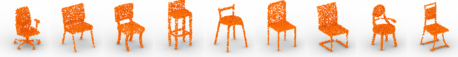| 
||
|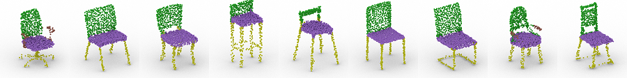| 
| **Global Shape Interpolation** |
|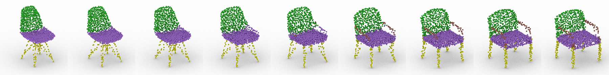| 
| **Back Interpolation** |
|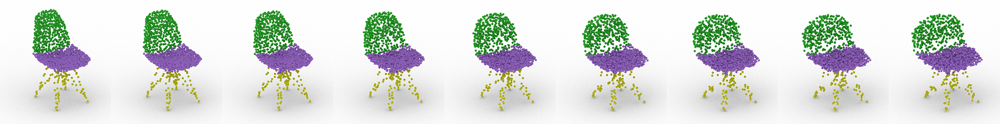| 
| **Seat Interpolation** |
|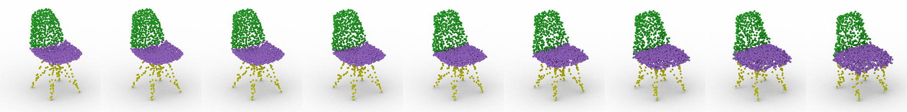| 
| **Leg Interpolation** |
|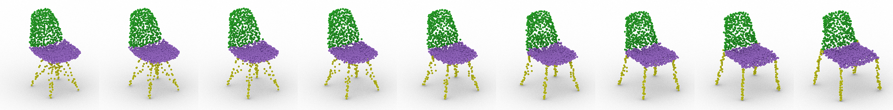| 
| **Arm Interpolation** |
|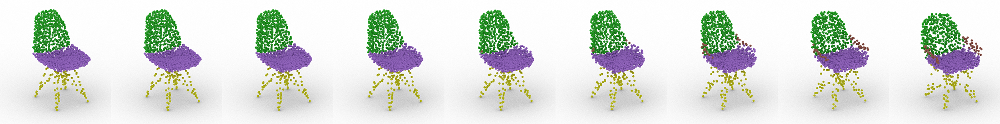| 

| Back | Seat | Leg | Arm | Composition |
| ------------- | ------------- | ------------- | ------------- | ------------- |
| 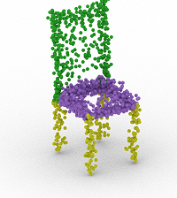  | 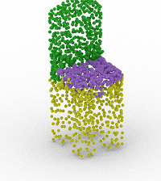  | 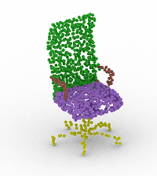  | 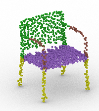  | 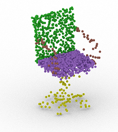  |

Visualizations are made with [Blender](https://www.blender.org/)
